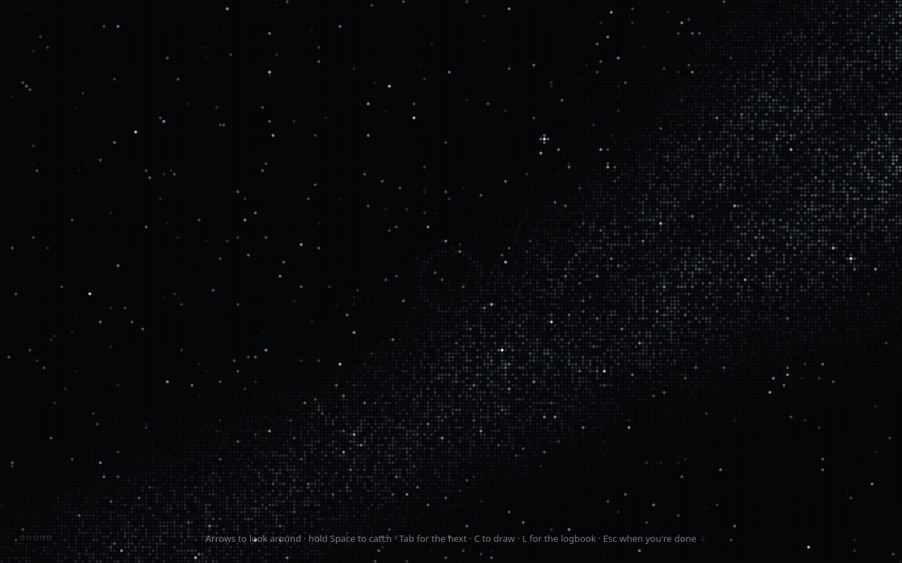
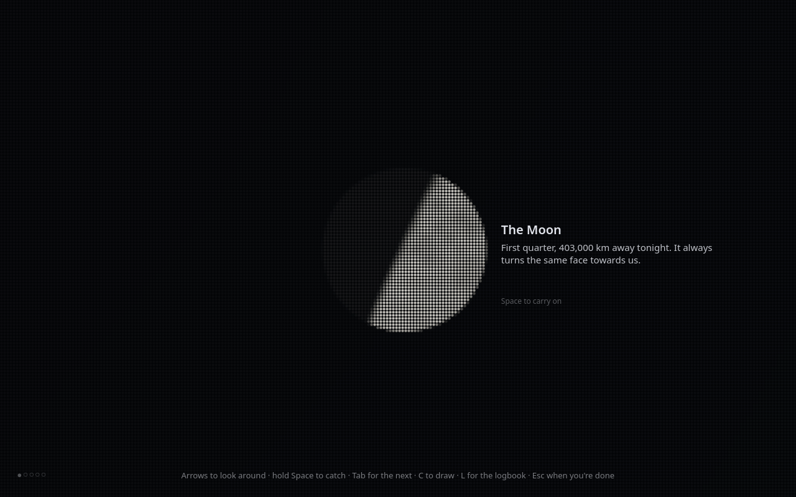

<div align="center">


# Night Sky

### Tonight's real sky, and then the real sky outside.

A small stargazing game that is designed to let you go.<br>
Nothing you write ever leaves your computer.



</div>

## What it is

Night Sky draws the sky over you right now, in fine dots: the real stars, the
Moon at its real phase, the planets that are really up, the Milky Way where it
really runs. Sweep across it and catch the night's handful of finds. Hold Space
on one and the view closes in; a card says something true about it, usually
about time or distance.

Each visit slows down as you play, dims for a real reason, and ends by naming
one thing you can go outside and see tonight.

## It wants you to leave

Most apps are built to keep you. This one is built to let you go, and it says
so here so there's no trick in it.

- **The sky is finite.** There are five to seven things to find each night.
  Once they're found, the sky is done until it has turned. Tomorrow really is
  different: the Moon moves about thirteen degrees a night.
- **It slows as you play.** The twinkle, the drift and the pace ease down over
  a visit, towards the speed of slow breathing. Nothing announces it.
- **It dims before the end.** Eyes take about twenty minutes to open fully to
  the dark, so the sky darkens to help yours begin.
- **The last line points outside.** *"If it's clear: Saturn is up in the
  south-west, the brightest thing there, and it doesn't twinkle. Give your eyes
  twenty minutes."* Then the window closes itself.
- **Nothing to come back for.** No streaks, scores, badges, levels,
  notifications or counts of nights. Missing a night costs nothing.

## The quiet part

As the sky comes up it asks if anything is heavy tonight. Write two or three
things and each becomes a warm star you hang low in the west. At the end the
sky time-lapses through the rest of the night, and you watch them set.

Now and then, at most twice a visit and never on your first night, the sky asks
a question as you catch something. They are small and specific, and they tend
to be about people, and about things to look forward to. When the answer is a
name, that person can have a star.

Everything goes into a **logbook**: a page for each night, and contents pages
that gather what keeps coming back, including the people whose names come up
again and again. Any weight can have a **course** charted for it, only if you
ask: a wish, the best of it, what gets in the way, and an if-then plan, with
your own earlier words to hand.

If anything you write sounds like real trouble, a helpline sits quietly beside
the sky: Samaritans 116 123 in the UK and Ireland, or findahelpline.com
anywhere else. Nothing is sent or flagged. It is a stargazing game with a
journal, not therapy or a crisis service.



## Keys

| Key | |
| --- | --- |
| Arrows, or drag | Look around |
| Scroll, `+` and `-` | Zoom |
| Hold `Space` | Catch what's in the ring |
| `Tab` | Turn towards the next find |
| `C` | Draw a constellation: arrows step between stars, `Enter` joins, `C` finishes |
| `L` | The logbook |
| `Esc` twice | End tonight's sky |
| `Ctrl` `,` | Settings |
| `F11` | Full screen |

## Private by design

- The Flatpak has **no network permission**, so nothing can leave, by
  construction.
- **Where you are** comes from your time zone's entry in the tz database, with
  no location service. It can be a few hundred kilometres out, which moves the
  sky by a few degrees; Settings takes a latitude and longitude if you want it
  closer.
- The logbook is **plain files**: a Markdown page per night and a few small
  TOML files, in `~/.var/app/io.github.peterwalker78.NightSky/data/night-sky/`.
  Settings can save a copy anywhere, or forget everything.

## Get it

Download `night-sky-x86_64.flatpak` from the
[latest release](https://github.com/peterwalker78/night-sky/releases/latest)
and install it:

```sh
flatpak install --user night-sky-x86_64.flatpak
```

It uses the GNOME 50 runtime from Flathub, which Flatpak fetches if it isn't
there. It ships with the [Slipstream](https://github.com/peterwalker78/slipstream-desktop)
desktop and runs on any Linux desktop.

## Build it

Rust (stable) and GTK 4.20 or newer.

```sh
scripts/check          # formatting, lints and tests
scripts/dev            # run from the source tree
scripts/flatpak        # build and install the Flatpak for this user
```

Any night can be tried out: `scripts/dev --at=2026-12-14T21:00 --speed=10`
starts the sky at the Geminids and runs it ten times faster, `--quick=10`
shortens the visit itself, `--place=LAT,LON` stands somewhere else, and
`--data=DIR` keeps everything in a scratch folder.

## Where the sky comes from

- **Stars:** the Yale Bright Star Catalogue, 5th revised edition (Hoffleit and
  Warren), from the [CDS](https://cdsarc.cds.unistra.fr/viz-bin/cat/V/50):
  every star to magnitude 6.5.
- **Constellation figures:** [d3-celestial](https://github.com/ofrohn/d3-celestial)
  by Olaf Frohn (BSD-3-Clause), matched to catalogue stars.
- **The Sun, Moon and planets:** mean orbital elements and their largest
  perturbations, after Paul Schlyter's
  [method](https://stjarnhimlen.se/comp/ppcomp.html). The tests check them
  against JPL Horizons: planets within 0.2°, the Moon within 0.1° as seen from
  the ground.
- **Meteor showers:** the International Meteor Organization's working list of
  visual meteor showers.

## Licence

GPL-3.0-or-later. The packed star and constellation data carry their own
credits above.

AI coding tools are used in writing Night Sky's code.
